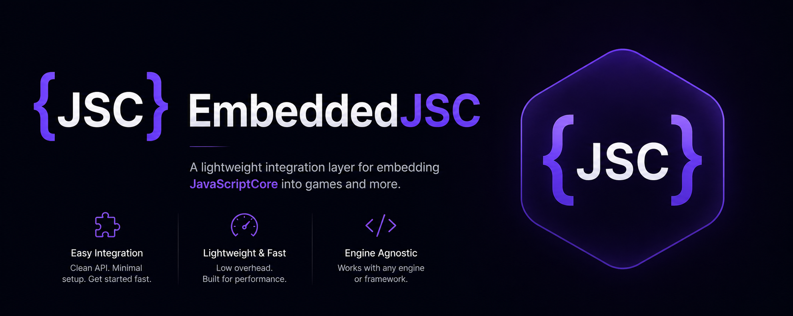

# EmbeddedJSC



A C++ embedding library for WebKit's JavaScriptCore aimed at a
QuickJS-class developer experience: register native functions, declare
native ES modules, evaluate scripts — all from C++, with **zero JS
bootstrap code**.

Tracking and roadmap live in [PLAN.md](PLAN.md). For a real integration —
game engine, daemon, worker — read [EMBEDDING.md](EMBEDDING.md).

## Status

Working today:
- One-shot JSC/WTF initialization (thread-safe, idempotent).
- `Runtime` / `Context` lifecycle with per-context VM + global object.
- `Value`: primitives, object property access, calls, native function
  binding via a JSClass closure.
- `Eval` (script) and `EvalModule` (source ES module). `EvalModule`
  reliably returns the module namespace so hosts can hold it and call
  exported functions per frame.
- **Native synthetic modules.** `import { foo } from 'mymod'` resolves
  to a C++ lambda — the library uses JSC's `SyntheticSourceProvider`
  so no JS source is parsed or generated for the bridge.
- **C++ class binding.** `Context::NewClass<T>("Foo")` exposes a C++
  type to JS as a JS-side constructor with methods. Supports both
  JS-owned (`cls.New(...)`) and embedder-owned (`cls.Wrap(ptr)`)
  instances.
- Optional helper `ejsc::extra::TimerManager` for `setTimeout` /
  `setInterval` / `clearTimeout` / `clearInterval` driven from a tick loop.

Examples and `tests/test_eval` (7/7) cover all of the above.

## Build (Windows, clang-cl)

Tech stack: C++20, CMake + vcpkg manifest mode, custom JSC overlay port
(prebuilt from Bun's WebKit fork), clang-cl, static MSVC runtime, Ninja.

```pwsh
# 1. Clone with submodules.
git clone --recursive <repo-url> EmbeddedJSC
# (or in an existing clone)
git submodule update --init

# 2. Bootstrap vcpkg once.
.\vcpkg\bootstrap-vcpkg.bat -disableMetrics

# 3. Configure + build.
cmake --preset windows-debug
cmake --build --preset windows-debug
```

Artifacts land in `BIN/Debug/`:
- `ejsc_hello.exe` — prints `hello, ejsc`, computes `1+2`.
- `ejsc_native_module.exe` — registers a `math` native module and
  runs `import { add, sub } from 'math'`. Run from the directory
  containing `test.js` (CMake copies it next to the executable).
- `ejsc_timers.exe` — drives the optional `ejsc::extra::TimerManager`
  helper with `setTimeout` / `setInterval` / `clearInterval`.
- `ejsc_classes.exe` — binds a `Vec3` C++ type to JS, demonstrates
  `new Vec3(...)` (JS-owned), `Wrap(...)` (host-owned), and `Unwrap()`.
- `ejsc_test_eval.exe` — assertion-based test runner.

## API at a glance

```cpp
#include <ejsc/ejsc.h>

int main() {
    ejsc::Runtime rt;
    auto ctx = rt.NewContext();

    // Expose print() as a global.
    ctx.SetGlobal("print", ejsc::Value::Function(ctx, "print",
        [](ejsc::Context& c, const ejsc::Value&,
           std::span<const ejsc::Value> args) {
            for (auto& a : args)
                std::cout << a.ToString().value_or("?") << ' ';
            std::cout << '\n';
            return ejsc::Value::Undefined(c);
        }));

    // Register a native ES module — pure C++, no JS bootstrap.
    auto math = ctx.NewModule("math");
    math.ExportFunction("add", [](ejsc::Context& c, const ejsc::Value&,
                                  std::span<const ejsc::Value> args) {
        return ejsc::Value::Number(c,
            *args[0].ToNumber() + *args[1].ToNumber());
    });
    math.Build();

    ctx.EvalModule(
        "import { add } from 'math'; print(add(2, 3));",
        "main.mjs");
}
```

## Layout

```
include/ejsc/         public headers (runtime, context, value, module, error)
src/                  implementation; src/internal is private to the lib
examples/hello        minimal Eval demo
examples/native_module  native ES module + import demo
tests/                assertion-based test executables
vcpkg/                vcpkg as a git submodule
vcpkg-ports/javascriptcore  custom overlay port for the Bun WebKit fork
```

## How synthetic modules work

When JS asks for `import { x } from 'name'`:

1. `customModuleLoaderResolve` returns the bare identifier.
2. `customModuleLoaderFetch` checks the context's native-module map.
   If `name` is registered, it returns a `JSSourceCode` whose provider
   is a `JSC::SyntheticSourceProvider`. Otherwise it rejects.
3. JSC's built-in `moduleLoaderParseModule` recognizes
   `SourceProviderSourceType::Synthetic`, calls the provider's
   generator, and feeds the resulting names + values into
   `SyntheticModuleRecord::tryCreateWithExportNamesAndValues`.
4. Linking and evaluation are handled by JSC's normal pipeline.

No JS strings, no `export const x = …` stubs.

## Out of scope (v1)

- Cross-platform (Windows-only for now).
- Timers are not in the core library — see
  [EMBEDDING.md](EMBEDDING.md#timers--you-must-implement-these). The
  optional `ejsc::extra::TimerManager` is a reference implementation that
  ships under [extra/](extra/).
- Promise rejection tracking, async stack tooling.
- Accessor properties on bound classes (use `getX()` / `setX()` methods for now).
- Class inheritance / static methods.
- TypedArray / ArrayBuffer helpers.
